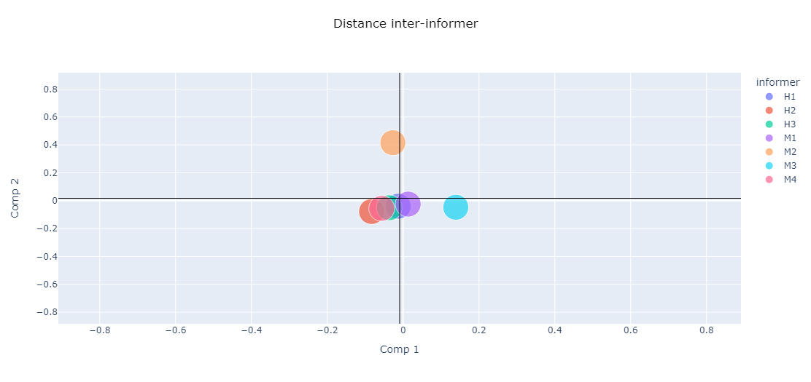

# Qualitative social data analysis
## Diego Dorrego
Here you can find some AI tools for qualitative research in social science. This is helpfull for social scientist who want to improve their methods and save time spent in pre-analysis:

## Wordclouds:

## Informer interventions:

## Topic analysis with BERTopic:

## Distance inter-informer:

## TF-IDF score for terms in documents:

