# QUALITATIVE DATA ANALYSIS WITH IA TOOLS
## Diego Dorrego
This repository shows some tools social data scientist can use in their analysis:

### WORDCLOUDS:
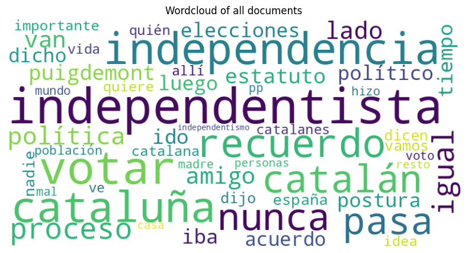

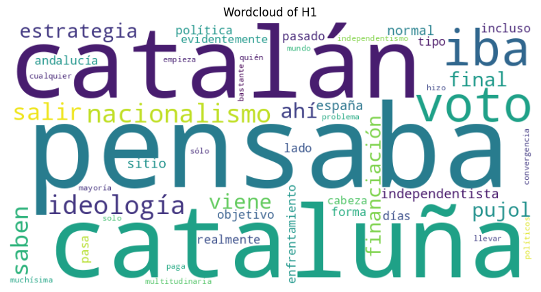

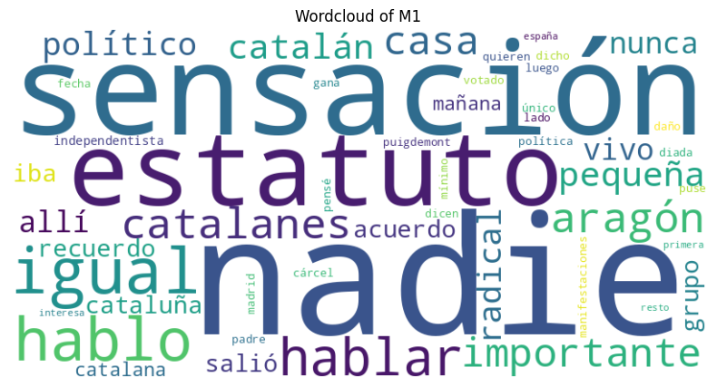

### INFORMER INTERVENTIONS:

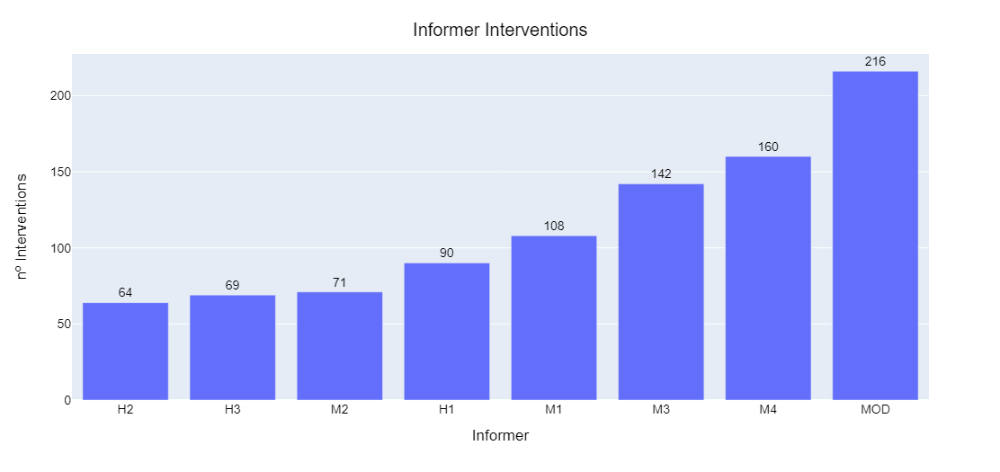

### TOPIC ANALYSIS WITH BERTOPIC:

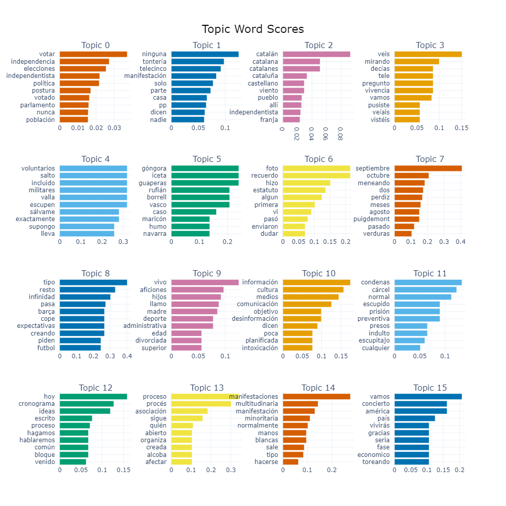

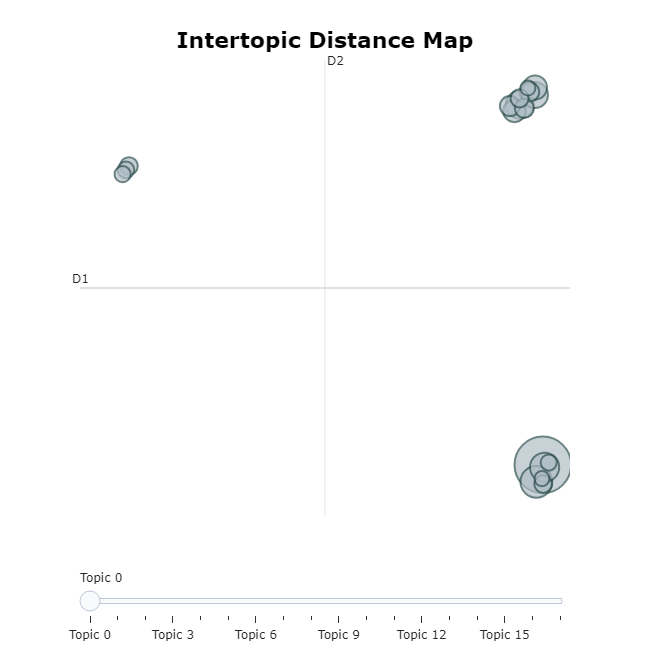

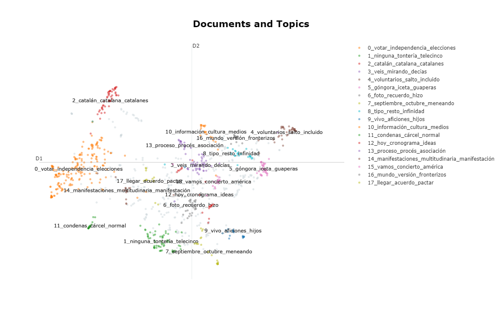

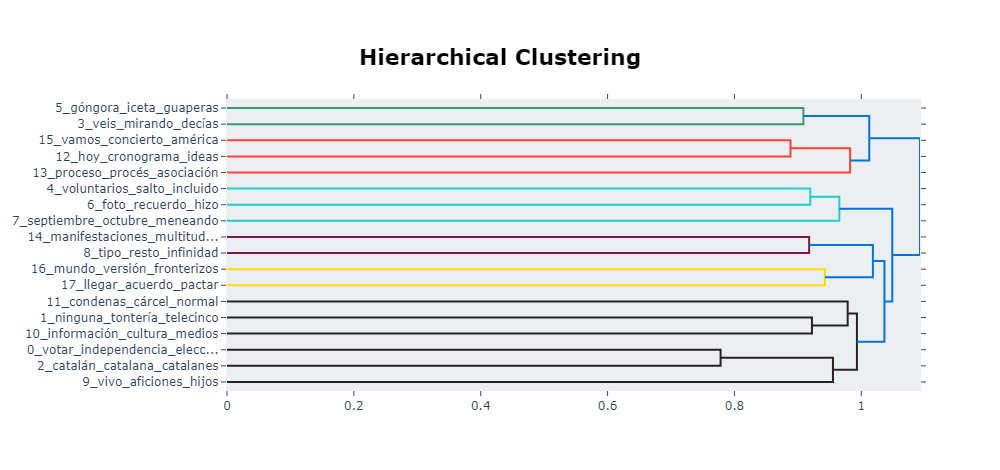

### INTER-INFORMER DISTANCE:

### TF-IDF SCORE FOR EACH TERM IN DOCUMENTS:

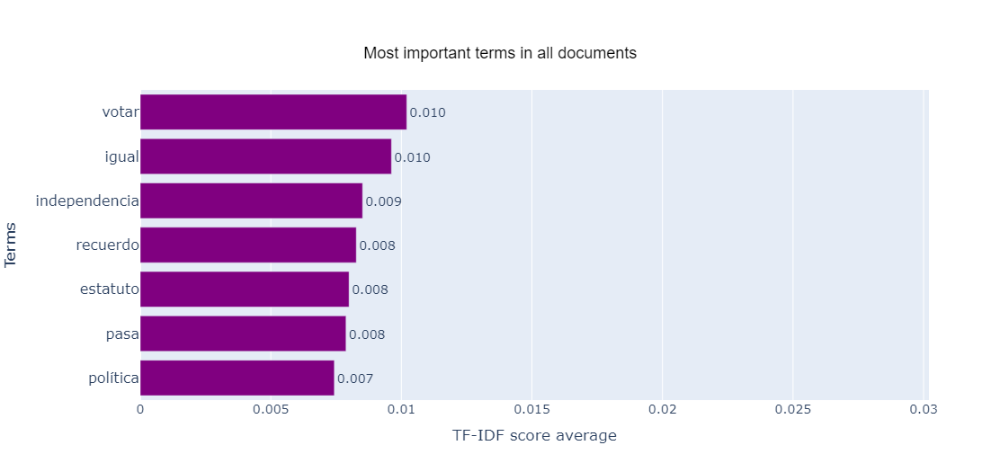

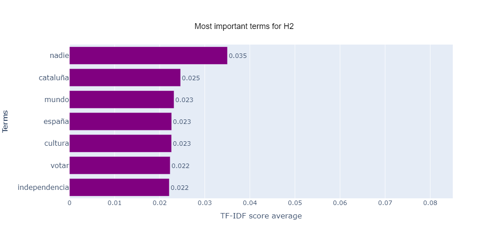

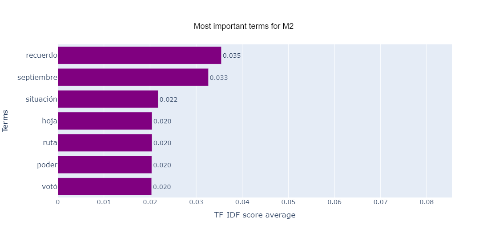
